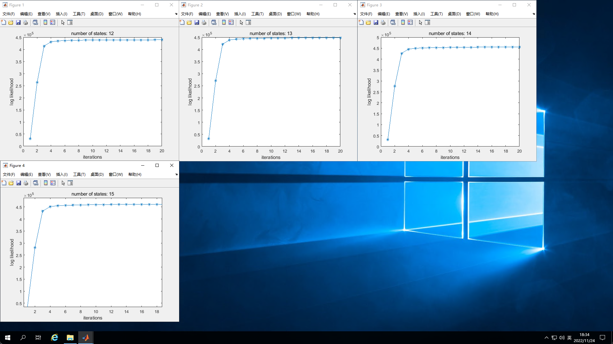
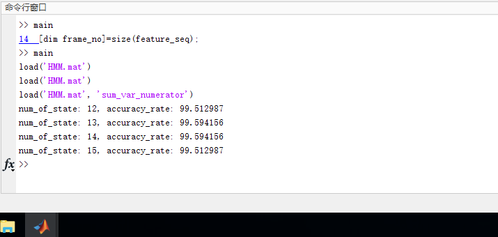
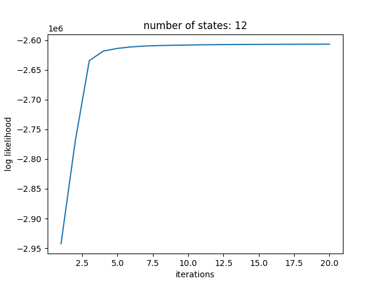
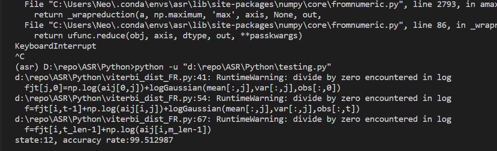
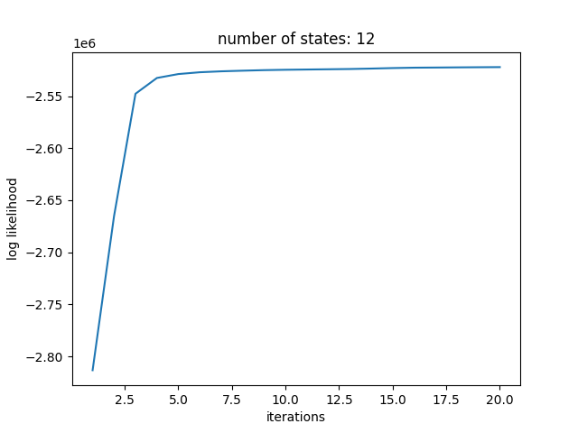
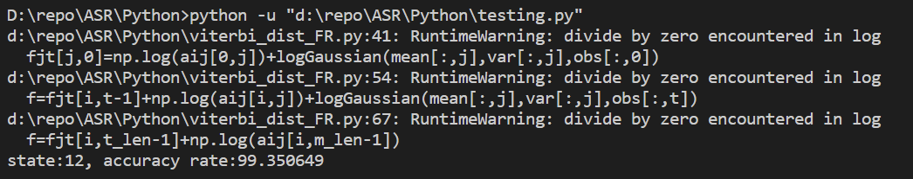

# ASR-Assignment2
**1953921 陈元哲**
## 1 程序结构

上图为程序调用关系图，描述了各个文件的核心功能和函数调用关系。

Python翻译程序结构与matlab程序基本相同，从`main.py`开始运行，首先对样例的mfcc特征进行提取并保存，之后生成测试与训练数据集文件的目录进行保存，再然后调用`EM_HMMtraning()`开始对HMM模型进行训练，在训练的时候首先对期望最大模型进行初始化，之后进行参数的计算，在每个状态训练结束后，会绘制似然值与训练迭代次数曲线。这里进行了对整帧计算而且进行了20次迭代，因此非常消耗时间，这也是后面只进行状态12的训练与测试的主要原因之一。在一个状态的训练结束之后，将调用`HMMtesting()`进行测试，使用HMM模型对语音特征进行推断，最后输出推断准确率。

虽然文件与函数调用结构在翻译时与matlab基本保持了一致，但是我也做出了一些针对性的处理。比如，对于`logGaussian`以及`log_sum_alpha`和`log_sum_beta`等可能重复使用的数学函数，并没有像matlab代码中每个文件一个函数实现的方式，而是使用`from EM_HMM_FR import`的方式，增强了代码的复用性。

由于程序运行时间较长，有时在训练与推断之间出现异常，我增加了使用保存的HMM模型进行推断的脚本`testing.py`。在测试过程中，主要运行的是`viterbi_dist_FR()`函数，其原理为初始化状态表，填入之前的状态后使用维特比算法得到最佳状态。

在翻译过程中，使用csv存储特征文件目录，使用pickle对数据进行打包存储，替代matlab中的`.mat`文件

## 2 程序性能

### matlab源程序性能

在服务器中训练结果如下

可以看到，matlab代码的模型训练效果较好，准确率较高，说明其算法的稳定性。

### 使用库函数提取特征的python程序性能

使用python库`python_speech_features`进行mfcc特征提取，由于在本地机器上不使用GPU运行单线程python代码，因此速度较慢，只测试了状态12

可以看到，使用python的库函数提取的特征进行训练的效果在准确率上与matlab相同，但是运行时间比matlab长很多，这可能是因为：

1. python代码为CPU单线程运行，matlab可能使用了多线程进行计算优化
2. matlab底层使用C进行实现，效率更高
3. matlab代码在计算服务器上运行，与本地笔记本电脑性能高出许多

### 使用自己编写的特征提取算法的python程序性能

使用自己的代码进行特征的训练结果收敛，说明了特征提取的正确性。在测试正确率上，比使用库的特征提取稍低(大约0.2)这再次说明了代码的正确性，以及相较于库中的特征提取，自己的算法还有一些不合理之处。在运行时间上，由于运行时间过长，在个人感知上并没有与标准库有太大差距。